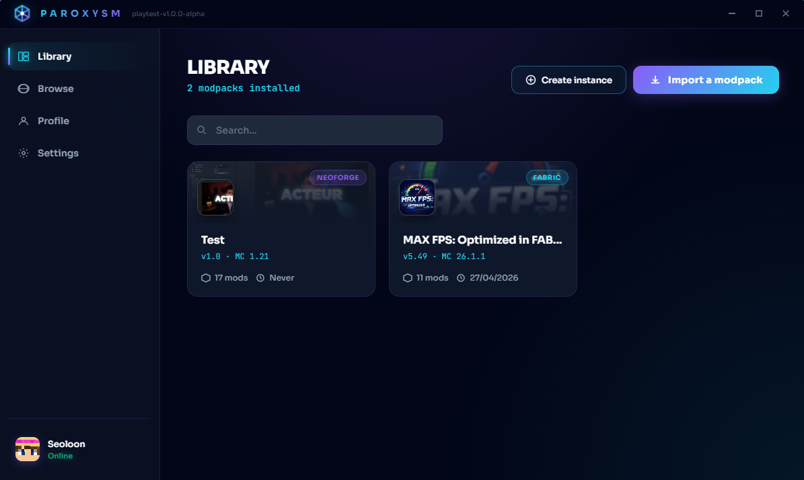

# Paroxysm Launcher

<p align="center">
  
</p>

<p align="center">
  Peak simplicity for modded Minecraft.
</p>

<p align="center">
  <a href="https://paroxysm.seoloon.work/"></a>
  <a href="https://discord.gg/MwVPxNXych"></a>
  <a href="https://www.youtube.com/@paroxysm_launcher"></a>
  <a href="mailto:contact@seoloon.work"></a>
</p>

<p align="center">
  
  
  
  
</p>

---

## Preview



---

## Why Paroxysm

Paroxysm is a desktop Minecraft launcher focused on:

- Fast startup and smooth UX
- Open-source transparency
- Clean, no-bloat workflow
- Direct modding workflows through integrated browsing and instance tools

---

## Features

- Microsoft authentication (Device Code Flow)
- Modrinth browser integration (mods, resource packs, shaders, modpacks)
- One-click add-content workflow for compatible instances
- Instance creation: Vanilla, Forge, NeoForge, Fabric, Quilt
- Per-instance settings (RAM, identity, icon, notes)
- Instance content explorer with filtering and search
- Strict "already installed" detection for quick add-content
- CurseForge import and name resolution improvements
- Discord Rich Presence
- Auto-update channels (Stable / Beta) via GitHub Releases

---

## Tech Stack

- Electron
- Vanilla HTML/CSS/JS renderer
- `electron-builder` for packaging
- `electron-updater` for update delivery

---

## Getting Started

### Requirements

- Node.js 18+ (recommended LTS)
- npm
- Windows for current playtest target

### Install

```bash
npm install
```

### Run (dev)

```bash
npm run dev
```

### Run (normal)

```bash
npm start
```

---

## Build

```bash
npm run check
npm run build:win
```

Other targets:

```bash
npm run build:linux
npm run build:mac
npm run build:all
```

---

## Release and Updates

Paroxysm is configured for GitHub-based publishing with two channels:

- Stable
- Beta

Update artifacts are generated for all channels (`generateUpdatesFilesForAllChannels: true`).

---

## Project Links

- Website: [paroxysm.seoloon.work](https://paroxysm.seoloon.work/)
- Discord: [discord.gg/MwVPxNXych](https://discord.gg/MwVPxNXych)
- YouTube: [@paroxysm_launcher](https://www.youtube.com/@paroxysm_launcher)
- Contact: [contact@seoloon.work](mailto:contact@seoloon.work)

---

## License

This project is licensed under the GNU GPL v3 License.  
See [LICENSE.md](LICENSE.md) for details.

